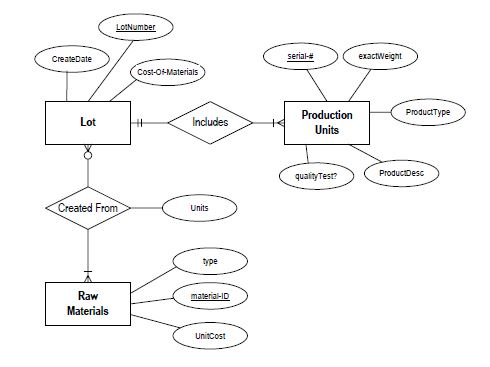

#####table name >> world

| name        |      continent     |  area    | population | gdp |
|----------   |:-------------:     |------:   |----------: |----:|
| Afghanistan |  South Asia        | 652225   |26000000    |     |
| Albania     |  Europe            | 28728    |3200000     | 6656000000    |
| Algeria     |  Middle East       | 2400000  |32900000    | 75012000000    |
| Andorra     |  Europe            | 468      |64000       |     |
| Brazil      |  South America     | 8550000  |182800000   |  564852000000   |
| Colombia    |  South America     | 1140000  |45600000    |     |
| Nauru       |  Asia-Pacific      | 21       |9900        |     |
| Uzbekistan  |  Central Asia      | 447000   |26000000    |     |
| Bangladesh | South Asia | 143998 | 152600000 | 67144000000 |
| United Kingdom | Europe | 242514 | 59600000 | 2022824000000 |


1. Select the answer which shows the problem with this SQL code - the intended result should be the single row    containing 'France':

  ```sql
    SELECT continent
     FROM world
    WHERE 'name' = 'France'
  ```
  - continent should be 'continent'
  - 'name' should be name
  - 'France' should be "France"
  - 'France' should be France
  - = should be IN

2. Select the code which would reveal the name and population of countries in Europe and Asia

  ```sql
      SELECT name
      FROM world
      WHERE continent IN ('Europe', 'Asia')
    ```

   ```sql
      SELECT name, population
      FROM world
      WHERE continent IN ('Europe', 'Asia')
    ```

    ```sql
      SELECT name, population
      FROM world
      WHERE name IN (Europe Asia)
    ```

    ```sql
      SELECT name, population
      FROM world
      WHERE name IS ('Europe', 'Asia')
    ```

    ```sql
      SELECT name, population
      FROM world
      WHERE continent = ('Europe', 'Asia')
    ```

3. Select the result that would be obtained from this code:

    ```sql
      SELECT name FROM world
      WHERE continent = 'South America'
      AND population > 40000000
    ```
    | name        |
    | :---------: |
    | Afghanistan |
    | Brazil      |
    | Colombia    |


    | name        |
    | :---------: |
    | Brazil      |


    | name        |
    | :---------: |
    | Brazil      |
    | Colombia    |

    | name        |name|
    | :---------: |:---: |
    | Brazil      |South America|
    | Colombia    |South America|

    | name        |name|
    | :---------: |:---: |
    | Brazil      |182800000|
    | Colombia    |45600000|


4. Select the code that shows the name, region and population of the smallest country in each region

    ```sql
      SELECT region, name,
      FROM world x WHERE population <= ALL
      (SELECT population FROM world y WHERE y.region=x.region AND population>0)
    ```

   ```sql
      SELECT region, name, population
      FROM world WHERE population <= ALL
      (SELECT population FROM world WHERE population>0)
    ```

    ```sql
       SELECT region, name, population
       FROM world x WHERE population <= ALL
       (SELECT population FROM world y WHERE y.region=x.region AND population>0)
    ```

    ```sql
       SELECT region, name, population
       FROM world x WHERE population = ALL
       (SELECT population FROM world y WHERE y.region=x.region AND population>0)
    ```

    ```sql
      SELECT region, name, population
      FROM world x WHERE population <= ALL
      (SELECT population FROM world y WHERE y.region=x.region AND population<0)
    ```

5. Select the result that would be obtained from the following code:
  ```sql
    SELECT name FROM world
    WHERE population >
       (SELECT population
          FROM bbc
         WHERE name='United Kingdom')
    AND region IN
       (SELECT region
          FROM bbc
         WHERE name = 'United Kingdom')
  ```

  | Table-A |
  | ------- |
  | Andorra |
  | Albania |
  | Austria |
  | Bulgaria |

  | Table-B| Table-B |
  | ------ | ------ |
  | France | Europe |
  | Germany | Europe |
  | Russia | Europe |
  | Turkey | Europe |

  | Table-C |
  | ------- |
  | France |
  | Germany |
  | Andorra |
  | Albania |

  | Table-D |
  | ------- |
  | France |
  | Germany |
  | Russia |
  | Turkey |

  | Table-E |
  | ------- |
  | France |
  | Germany |
  | Russia |
  | Turkey |
  | Brazil |
  | United States of USA |
  | Canada |

6. Select the result that would be obtained from the following code:
  ```sql
     SELECT region, SUM(area)
     FROM world
     WHERE SUM(area) > 15000000
     GROUP BY region
  ```
  |Table-A  | |
  | ------- | ------ |
  | Europe | 17000000 |

  |Table-B| |
  | ------- | ------ |
  | Europe | 17000000 |
  | Asia-Pacific | 23460000 |
  | North America | 21660000 |

  |Table-C|
  | ------- |
  | Europe |
  | Asia-Pacific |
  | North America |

  No result due to invalid use of the GROUP BY function

  No result due to invalid use of the WHERE function

7. Pick the result that would be obtained from the following code:
  ```sql
    SELECT region, SUM(area)
    FROM world
    GROUP BY region
    HAVING SUM(area)<= 20000000
  ```
  |Table-A|
  | ------ |
  | 732240 |
  | 13403102 |
  | 17740392 |
  | 4943771 |

  |Table-B| |
  | ------- | ------|
  | Africa | 22550927 |
  | Asia-Pacific | 28759578 |
  | Europe | 23866987 |
  | North America | 21660000 |

  |Table-C|
  | ------- |
  | Africa |
  | Asia-Pacific |
  | Europe |
  | North America |

  |Table-D| |
  | ------- | ------- |
  | Americas | 732240 |
  | Middle East | 13403102 |
  | South America | 17740392 |
  | South Asia | 9437710 |

  |Table-E|
  | ------- |
  | Americas |
  | Middle East |
  | South America |
  | South Asia |

8.  Select the statement that shows the list of actors called 'John' by order of number of movies in which they acted

  ```sql
    SELECT name, COUNT(movieid)
    FROM actor JOIN casting ON actorid=actor.id
    WHERE name IN 'John %'
    GROUP BY name ORDER BY 2
  ```

 ```sql
    SELECT name, COUNT(movieid)
    FROM actor JOIN casting ON actorid=actor.id
    WHERE name LIKE 'J%'
    GROUP BY name ORDER BY 2 DESC
  ```

  ```sql
     SELECT name, COUNT(movieid)
    FROM casting JOIN actor ON actorid=actor.id
    WHERE name LIKE 'John %'
    GROUP BY name ORDER BY 2 DESC
  ```

  ```sql
    SELECT name, COUNT(movieid)
    FROM casting JOIN actor
    WHERE (actorid ON actor.id)
    AND name LIKE 'John %'
    GROUP BY name ORDER BY 2 DESC
  ```

  ```sql
    SELECT name, COUNT(movieid)
    FROM casting JOIN actor
    WHERE name LIKE 'John %'
    GROUP BY name ORDER BY COUNT(movieid) DESC
    ```

9.  Select the statement that lists all the actors that starred in movies directed by Ridley Scott who has id 351

   ```sql
    SELECT name
    FROM movie JOIN casting
    AND actor ON movie.id = movieid
    AND actor.id = actorid
    WHERE ord = 1
    AND actor = 351
  ```

 ```sql
    SELECT name
    FROM movie JOIN casting
    JOIN actor ON movie.id = movieid
    OR actor.id = actorid
    WHERE ord = 1 AND director = 351
  ```

  ```sql
    SELECT name
    FROM movie JOIN casting ON movie.id = movieid
    JOIN actor ON actor.id = actorid
    WHERE ord = 1 AND actorid = 351
  ```

  ```sql
    SELECT name
    FROM movie JOIN casting ON actor.id = actorid
    JOIN actor ON movie.id = movieid
    WHERE ord = 1 AND director = 351
  ```

  ```sql
    SELECT name
    FROM movie JOIN casting ON movie.id = actorid
    JOIN actor ON actor.id = movieid
    WHERE director = 351
  ```

    self join tables
    <table>
    <tbody><tr><th><b>stops</b></th><th><b>route</b></th></tr>
    <tr><td>id</td><td>num</td></tr>
    <tr><td>name</td><td>company</td></tr>
    <tr><td></td><td>pos</td></tr>
    <tr><td></td><td>stop</td></tr>
    <tr><td></td><td></td></tr>
    </tbody></table>

10. Select the code that shows the stops that are on route.num '2A' which can be reached with one bus from Haymarket?

 ```sql
    SELECT S2.id, S2.name, R2.company, R2.num
    FROM stops S1, stops S2, route R1, route R2
    WHERE S1.name='Haymarket' AND S1.id=R1.stop
    AND R1.company=R2.company AND R1.num=R2.num
    AND R2.stop=S2.id AND R1.num='2A'
  ```

  ```sql
    SELECT S2.id, S2.name, R2.company, R2.num
    FROM stops S1, stops S2, route R1, route R2
    WHERE S1.name='Craiglockhart' AND S1.id=R1.stop
    AND R1.company=R2.company AND R1.num=R2.num
    AND R2.stop=S2.id AND R2.num='2A'
  ```

  ```sql
    SELECT S2.id, S2.name, R2.company, R2.num
    FROM stops S1, stops S2, route R1, route R2
    WHERE S1.name='Haymarket' AND S1.id=R1.stop
    AND R1.company=R2.company AND R1.num=R2.num
    AND R2.stop=S2.id
  ```

  ```sql
    SELECT S2.id, S2.name, R2.company, R2.num
    FROM stops S1, stops S2, route R1, route R2
    WHERE S1.name='Haymarket' AND S1.id=R1.stop
    AND R1.company=R2.company AND R1.num=R2.num
    AND R2.stop=S2.id AND R2.num='2'
  ```

  ```sql
    SELECT S2.id, S2.name, R2.company, R2.num
    FROM stops S1, stops S2, route R1, route R2
    WHERE S1.name='Haymarket' AND S1.id=R1.stop
    AND R1.company=R2.company AND R1.num=R2.num
    AND R2.stop=S2.id AND R2.num='2A'
  ```

11. How would you design an efficient database schema for a user authorization system?

 - [ ]  Table names: `users`, `permissions`; Columns: `users.permissions` (ENUM)
 - [ ]  Table names: `users`, `roles`, `users_roles`; Columns: `users_roles.role_id` (INT), `users_roles.user_id` (INT)
 - [ ]  Table names: `users`, `roles`; Columns: `roles.id` (INT, *unique*), `users.role_id` (INT)
 - [ ]  **Tables: `users`, `permissions`, `roles`, `permissions_roles`; Columns: `users.role_id` (INT, *unique*), `permissons_roles.role_id` (INT)**

12. Normalization is a process within logical design. What is the general goal of
normalization?

  - [ ] To be able to gather data
  - [ ] To remove redundancy in data
  - [ ] To have clean data
  - [ ] To ensure tables relationships are maintained
  - [ ] To improve efficiency of our database queries


  Production tracking is important in many manufacturing environments (e.g., the pharmaceuticals
  industry, children’s toys, etc.). The following ER diagram captures important information in the
  tracking of production. Specifically, the ER diagram captures relationships between production
  lots (or batches), individual production units, and raw materials.

  

13. Please convert the ER diagram into a relational database schema. Be certain to indicate
primary keys and referential integrity constraints.

